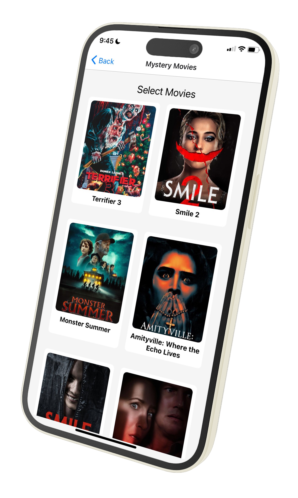

# Movie Recommend App 🎬

An app for movie recommendations and categorizing movies by genre using React Native and the TMDB API.

---

## Features ✨
- Display **Popular Movies** on the home screen
- Select a movie **Genre** and display movies in that genre
- View detailed information about each movie, such as synopsis, ratings, and more
<!--
---

## Tech Stack 🛠️
- **Framework**: React Native
- **Navigation**: React Navigation
- **API**: TMDB (The Movie Database) API
- **State Management**: useState, useEffect
- **Styling**: StyleSheet
-->
---

## Screenshots 📱
1. **Home Screen**  
   

2. **Genre Movies Screen**  
   

3. **Movie Detail Screen**  
   

---
## Installation 🛠️

### **1. Clone Repository**
```bash
git clone https://github.com/your-username/your-repo-name.git
cd your-repo-name
```
### **2. Install Dependencies**
```bash
npm install
```
### **3. Run the App**
- For iOS
```bash
npx react-native run-ios
```
- For andriod
```bash
npx react-native run-android
```
---
## API Configuration 🔑
- Sign up at The Movie Database and get your API key.
- Create a .env file in your project:
```
TMDB_API_KEY=your_api_key_here
```
- Use the API key in your code:
```bash
const TMDB_BASE_URL = 'https://api.themoviedb.org/3';
const API_KEY = process.env.TMDB_API_KEY;
```
